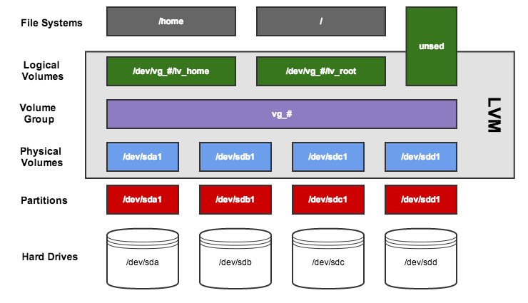

# LVM Cheatsheat

### LVM - Definitions
---
**PE: Physical Extents**<br>Small PV sliced into 4MB chunks by default<br>  
**LE: Logical Extents**<br>Small VG sliced into 4MB chunks by default<br>                                               
**PV: Physical Volumes**<br>Disks, partitions, volumes RAID.<br>                                                        
**VG: Volume Groups**<br>Aggregate of one or more PV, equivlant to a pseudo disk<br>                                
**LV: Logical Volumes**<br>VG slice, equivalent to a partition.<br>                                                   
**PVRA: Physical Volume Reserved Area**<br>Contains PV specific LVM metadata <br>                                     
**VGRA: Volume Group Reserve Area**<br>Contains metadata related to the VG as well as the LVs container in the VG<br>   
**BBRA: Bad Block Relocation Area**<br>Zone containing metadata related to bad block reallocation management.<br>        

### LVM-LV
---
**lvchange**
> Change LV attributes

**lvconvert**
> Converting LV linear to mirror or snapshot

**lvcreate**
> Creation of LV

**lvdisplay**
> Displays LVs

**lvextend**
> LV increase

**lvreduce**
> LV Reduction

**lvremove**
> LV removal

**lvrename**
> Renaming an LV
**lvresize**
> Resizing an LV

**lvs**
> LV Info

**lvscan**
> Look for the LVs

### LVM - Files
--- 
/etc/lvm/lvm.conf

$HOME/.lvm_history

---
### lvm - lvm
---
**lvm**
> Pseudo shell-cli for LVM

**lvmconf**
> Modify LVM config

**lvmdiskscan**
> Scan all devices to find HP

**lvmdump**
> LVM info dump

**lvmetad**
> Cache daemon for LVM metadata

**lvmsadc**
> LVM system activity data collector (LVM1)

**lvmsar**
>LVM activity reporting<br>   

---
### LVM-VG
---
**vgcfgbackup**
> Allows to make a backup of VG metadata<br>  

**vgck**
> Check VG metadata

**vgdisplay**
> Displays VG Info

**vgimport**
> Import from VG

**vgmknodes**
> Recreate a VG Folder

**vgrename**
> Renaming a VG

**vgsplit**
> Split a VG in 2

**vgcfgrestore**
> Restore metadata

**vgconvert**
> Allows you to change the metadata format

**vgexport**
> Export from VG

**vgimportclone**
> Import and rename a VG via duplication

**vgreduce**
> Reduces one VG

**vgs**
> VG info

**vgchange**
> Change VG attributes

**vgcreate**
> Creation of VG

**vgextend**
> Extend a VG

**vgmerge**
> Merge 2 VG

**vgremove**
> VG removal

**vgscan**
> Scan disks to find VGs


---	 
### LVM-PV
---
**pvchange**
> Change HP attributes

**pvck**
> Check PV metadata

**pvcreate**
> Creation of PV

**pvdisplay**
> Displays PV info

**pvmove**
> Moves SPs by one PV (before removal/replacement)

**pvremove**
> Removes a PV

**pvresize**
> Scales a PV

**pvs**
> PV Info

**pvscan**
> Scan devices for PVs

---
### LVM - LV extend
---
Unmounting the file system
```
umount /dev/vg00/lv_home
```

Increasing Logical Volume Size
```
lvextend -L +10G /dev/vg00/lv_home
```

Forced file system check
```
e2fsck -f /dev/vg00/lv_home
```

Increase in file system size
```
resize2fs /dev/vg00/lv_home
```

Remounting the file system 
```
mount /dev/vg00/lv_home
```

---
### LVM - VG extend
---

Creation of the new PV
```
pvcreate /dev/sdb1
```

Added PV in VG00
```
vgextend vg00 /dev/sdb1
```

Verification 
```
vgdisplay
```

---
### LVM - VG reduce
---

Check that the remaining space will be large enough to accommodate the data.
```
vgdisplay;  pvdisplay
```

Move the data it contains to the other PVs of VG00
```
pvmove /dev/sdb1
```
Verification that the PV /dev/sdb1 is empty
```
pvs -o+pv_used
```

We remove the PV /dev/sdb1 from the VG00
```
vgreduce vg00 /dev/sdb1
```

Removes all empty VG00 PV 
```
or vgreduce -a
```


---
### LVM -Schema
---


---
### LVM - LV extend swap
---

Disable LV swap
```
swapoff -v /dev/vg00/lv_swap
```

Resizing
```
lvresize /dev/vg00/lv_swap -L 8G
```

Formatting
```
mkswap /dev/vg00/lv_swap
```

Reactivation
```
swapon -v /dev/vg00/lv_swap
```

Verification 
```
free
```

---
### LVM - commands adv.
---

Increase the size of an LV
```
lvextend -L size /dev/vg00/lv_home
```

Reduce the size of an LV
```
lvreduce -L size /dev/vg00/lv_home
```

Resizing the size of an LV 
```
lvresize -L size /dev/vg00/lv_home
```

#### Size can be expressed in several ways:
> 2G: the size of the LV will be 2GB<br>
> +2G: we add 2GB to the existing size<br>
> -2G: we remove 2GB from the existing size<br> 